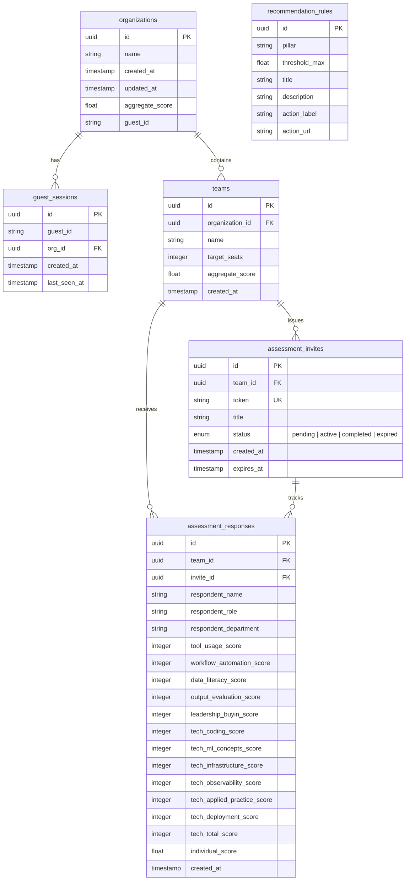

# System Architecture & Technical Specifications

This document details the architectural design, security model, component hierarchy, and database schema for the **TAI Labs Enterprise AI Readiness Platform**.

---

## 1. High-Level System Architecture

The application is built on **Next.js 15 App Router** using TypeScript, Tailwind CSS, and a **Supabase (PostgreSQL)** backend. It enforces an isolated, guest-session tenant architecture for instant onboarding without explicit password registration.

```mermaid
graph TB
    subgraph ClientLayer["Client Layer"]
        Browser["User Browser (Admin / Respondent)"]
        FP["Client Fingerprinter (localStorage)"]
    end

    subgraph EdgeLayer["Edge / Middleware Layer"]
        MW["Next.js Middleware (src/middleware.ts)"]
        Cookie["Session Cookie (tai_guest_id)"]
    end

    subgraph AppLayer["Application Layer (Next.js 15 App Router)"]
        subgraph ServerRoutes["Server Routes & API"]
            GuestLogin["POST /api/auth/guest-login"]
            GenerateInvite["POST /api/invites/generate"]
            ValidateInvite["GET /api/invites/validate"]
            SubmitAssessment["POST /api/assessment/submit"]
            GetDashboard["GET /api/dashboard"]
        end

        subgraph ClientPages["Client Pages & Components"]
            LoginPage["/login (Admin Sign In)"]
            AdminDash["/admin (Dashboard & Analytics)"]
            DistPage["/admin/distribution (Invite Manager)"]
            EvalPage["/eval/invite (Assessment Wizard)"]
        end

        ScoreEngine["Scoring Engine (src/lib/scoringEngine.ts)"]
    end

    subgraph DataLayer["Data & Storage Layer (Supabase / PostgreSQL)"]
        SupaAdmin["Supabase Service Role Admin Client"]
        
        subgraph PostgreSqlTables["PostgreSQL Tables"]
            Orgs["organizations"]
            Sessions["guest_sessions"]
            Teams["teams"]
            Invites["assessment_invites"]
            Responses["assessment_responses"]
            Rules["recommendation_rules"]
        end
    end

    Browser --> FP
    Browser --> MW
    MW --> Cookie
    LoginPage --> GuestLogin
    GuestLogin --> SupaAdmin
    DistPage --> GenerateInvite
    EvalPage --> ValidateInvite
    EvalPage --> SubmitAssessment
    AdminDash --> GetDashboard

    SubmitAssessment --> ScoreEngine
    GetDashboard --> ScoreEngine

    SupaAdmin --> Orgs
    SupaAdmin --> Sessions
    SupaAdmin --> Teams
    SupaAdmin --> Invites
    SupaAdmin --> Responses
    SupaAdmin --> Rules
```



---

## 2. Technology Stack & Key Dependencies

| Layer | Technology | Purpose |
| :--- | :--- | :--- |
| **Framework** | Next.js 15.1 (App Router) | Server-side routing, API routes, middleware, server actions |
| **UI Library** | React 19, Tailwind CSS | Responsive, modern user interfaces |
| **Icons & Visuals** | Lucide React | Clean, scalable vector iconography |
| **Notifications** | Sonner | Toast notification system |
| **Token Generation**| NanoID | Cryptographically secure 64-char token generation |
| **Database** | Supabase (PostgreSQL) | Managed relational database with RLS policies |
| **Database Client** | `@supabase/supabase-js` | Admin client execution with Service Role Key |

---

## 3. Directory & File Organization

```
tailabs_AI-readiness/
├── docs/                        # Deep-dive documentation
│   ├── ARCHITECTURE.md          # Architecture & Security Model
│   ├── PROGRAM_FLOW.md          # End-to-End Sequence & Scoring Specs
│   └── API_REFERENCE.md         # API Specification & Endpoints
├── src/
│   ├── app/                     # App Router pages & API endpoints
│   │   ├── admin/               # Admin Portal
│   │   │   ├── distribution/    # Invite Link Management Page
│   │   │   ├── loading.tsx      # Admin Skeleton Loader
│   │   │   └── page.tsx         # Admin Dashboard Main View
│   │   ├── api/                 # Backend REST Endpoints
│   │   │   ├── assessment/      # Assessment Submission Route
│   │   │   ├── auth/            # Guest Auth & Session Management
│   │   │   ├── dashboard/       # Aggregated Dashboard Metrics Route
│   │   │   └── invites/         # Invite Generation, List & Validation
│   │   ├── eval/
│   │   │   └── invite/          # Respondent Assessment Entry Point
│   │   ├── login/               # Admin Sign-In & Workspace Creation
│   │   ├── globals.css          # Design System Tokens & Styling
│   │   ├── layout.tsx           # Root HTML Layout
│   │   └── page.tsx             # Root Redirect (/ -> /login)
│   ├── components/              # Modular UI Components
│   │   ├── admin/               # Dashboard Charts, Scorecards & Tables
│   │   ├── assessment/          # Wizard, Technical Scenario & Validator
│   │   ├── common/              # Shared Pillar Icons & Badges
│   │   ├── layout/              # Global Footer
│   │   └── ui/                  # Shadcn-inspired Primitive Components
│   ├── lib/                     # Core Business Logic & Clients
│   │   ├── scoringEngine.ts     # Formulae, Percentages & Recommendations
│   │   ├── utils.ts             # Tailwind Class Merging Utility
│   │   └── supabase/            # Client, Server, Admin & Database Types
│   └── middleware.ts            # Auth & Routing Guard
├── supabase/
│   └── migrations/              # Database Schema & RLS Migrations
└── README.md                    # Main Repository Overview
```

---

## 4. Authentication & Security Architecture

### 4.1 Fingerprint-Based Guest Authentication
The platform provides a seamless guest workspace initialization flow:
1. **Client-Side Fingerprinting**: When an admin visits `/login`, [`getOrCreateGuestId()`](file:///Users/sethummethsanda/Documents/Dev/tailabs_AI-readiness/src/app/login/page.tsx#L33) constructs a deterministic hash incorporating `navigator.userAgent`, screen dimensions, timezone, language, and random salt, stored in `localStorage`.
2. **Guest Login API**: [`POST /api/auth/guest-login`](file:///Users/sethummethsanda/Documents/Dev/tailabs_AI-readiness/src/app/api/auth/guest-login/route.ts) creates or fetches a dedicated record in `organizations` and updates `guest_sessions`.
3. **HttpOnly Cookie**: The server responds with a secure HttpOnly cookie named `tai_guest_id` set to the guest organization ID (24-hour expiration).

### 4.2 Middleware Route Protection
The [`middleware.ts`](file:///Users/sethummethsanda/Documents/Dev/tailabs_AI-readiness/src/middleware.ts) acts as an edge security boundary:
- **Public Routes**: `/login`, `/eval/*`, `/api/auth/*`, `/api/assessment/submit`, `/api/invites/validate`, static assets.
- **Protected Routes**: `/admin/*`, `/api/dashboard`, `/api/invites/*`.
- **Header Injection**: If `tai_guest_id` is present, middleware injects the custom header `x-tai-org-id` into down-stream requests. Unauthenticated access to protected routes is redirected to `/login`.

### 4.3 Supabase Database Client & RLS
- **Service Role Key**: Server-side API endpoints instantiate `createAdminClient()` using `SUPABASE_SERVICE_ROLE_KEY` to perform secure workspace-isolated queries.
- **Row Level Security (RLS)**: RLS is enabled across all tables (`organizations`, `teams`, `assessment_invites`, `assessment_responses`, `recommendation_rules`). Public read policies are maintained for global `recommendation_rules`.

---

## 5. Database Entity Relationship Diagram (ERD)


