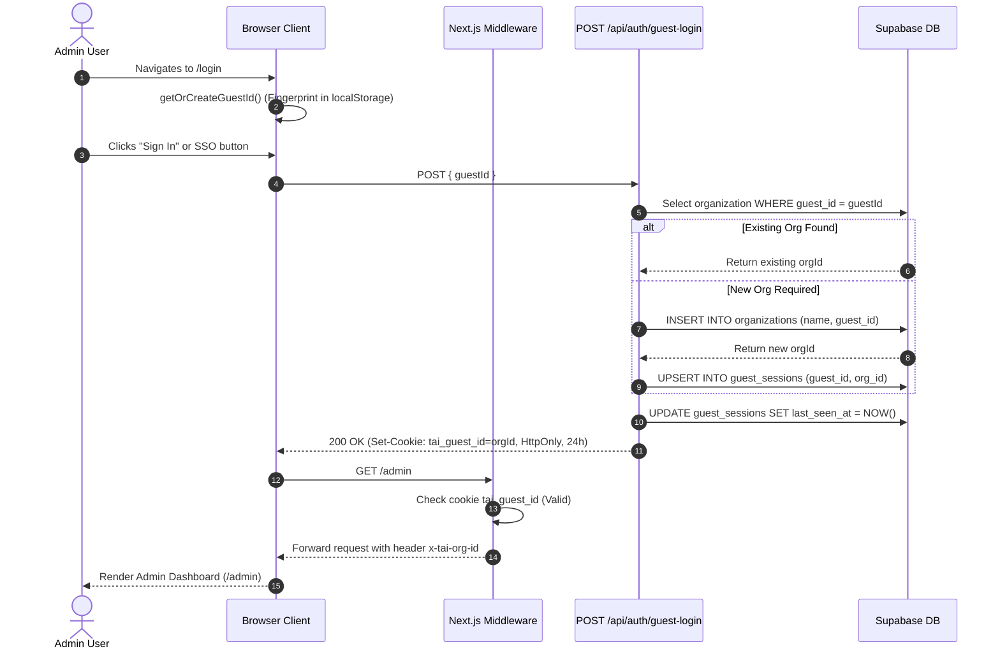
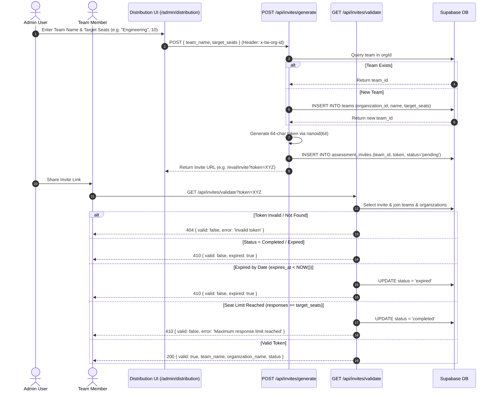
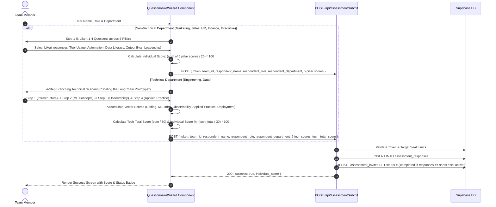
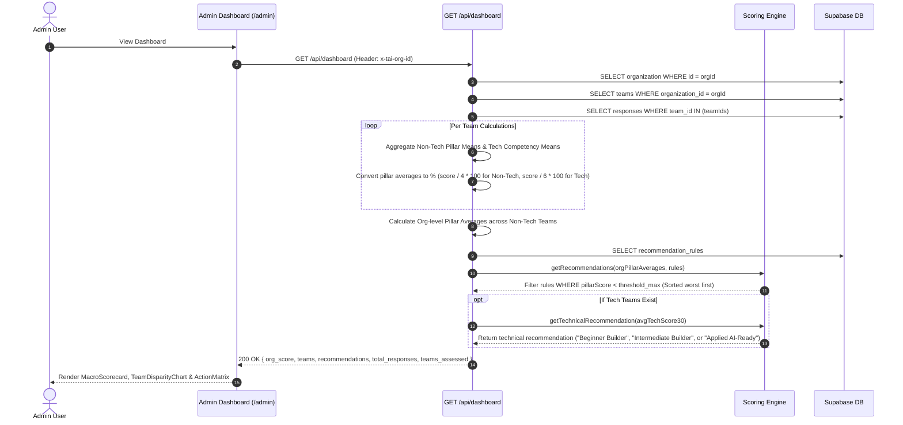

# Comprehensive Program Flow & Scoring Engine Specifications

This document outlines the step-by-step execution flows, sequence diagrams, and mathematical scoring specifications for the **TAI Labs Enterprise AI Readiness Platform**.

---

## 1. End-to-End Execution Flows & Sequence Diagrams

### Flow 1: Admin Authentication & Workspace Initialization

---

### Flow 2: Assessment Invite Link Generation & Token Validation

---

### Flow 3: Assessment Evaluation & Dual-Track Execution

The assessment wizard operates in two distinct tracks based on the respondent's department selection:

---

### Flow 4: Real-time Scoring & Dashboard Analytics Aggregation

---

### 2. Mathematical Scoring Engine Specifications

All score calculations reside in [`src/lib/scoringEngine.ts`](file:///Users/sethummethsanda/Documents/Dev/tailabs_AI-readiness/src/lib/scoringEngine.ts).

### 2.1 Individual Score Calculation (Non-Technical Persona)
For non-technical department respondents, the assessment measures 5 core pillars rated on a 1–4 Likert scale (1 = Novice, 2 = Developing, 3 = Proficient, 4 = Expert):
- Tool Usage ($P_1$)
- Workflow Automation ($P_2$)
- Data Literacy ($P_3$)
- Output Evaluation ($P_4$)
- Leadership Buy-in ($P_5$)

$$\text{Individual Score (\%)} = \left( \frac{\sum_{i=1}^{5} P_i}{20} \right) \times 100$$

### 2.2 Technical Score Calculation (Engineering / Data Persona)
For technical department respondents, scores are accumulated across 6 technical competency vectors (each rated 0–6) through decision choices in a 4-step branching scenario:
- Technical Coding ($T_1$)
- ML Concepts ($T_2$)
- Infrastructure ($T_3$)
- Observability ($T_4$)
- Applied Practice ($T_5$)
- Deployment ($T_6$)

$$\text{Technical Score (Out of 30)} = \sum_{i=1}^{6} T_i$$

$$\text{Individual Score (\%)} = \left( \frac{\text{Technical Score}}{30} \right) \times 100$$

### 2.3 Likert & Pillar Percentage Conversions
To normalize raw 1–4 Likert averages for team/org dashboard charts into standard 0–100% scale:

$$\text{Pillar Score (\%)} = \left( \frac{\text{Raw Score}}{4} \right) \times 100$$

For technical competency vectors (0–6):

$$\text{Tech Vector Score (\%)} = \left( \frac{\text{Raw Score}}{6} \right) \times 100$$

---

## 3. Status Color & Semantic Threshold Mapping

Scores map deterministically to semantic status categories across the dashboard:

| Score Range | Status Code | Label | Color Hex | Background Color |
| :--- | :--- | :--- | :--- | :--- |
| **< 40%** | `danger` | Low Readiness | `#F44336` | `rgba(244, 67, 54, 0.1)` |
| **40% – 70%** | `warning` | Developing | `#FF7300` | `rgba(255, 115, 0, 0.1)` |
| **> 70%** | `success` | High Readiness | `#4CAF50` | `rgba(76, 175, 80, 0.1)` |

---

## 4. Deterministic Recommendation Engine Rules

The recommendation engine filters database rules stored in `recommendation_rules` against the organization's aggregated pillar averages:

1. **Threshold Evaluation**: A recommendation rule is triggered if $\text{Pillar Average} < \text{threshold\_max}$.
2. **Prioritization Sorting**: Recommendations are sorted in ascending order of `pillarScore` so that the worst-performing pillar is presented at the top of the **Action Matrix**.
3. **Technical Personas**: If technical teams are present and average tech score is under 70%, a custom technical recommendation is injected:
   - Score ≤ 10/30 → **Beginner Builder**
   - Score 11–20/30 → **Intermediate Builder (7-Day Challenge)**
   - Score > 20/30 → **Applied AI-Ready**
